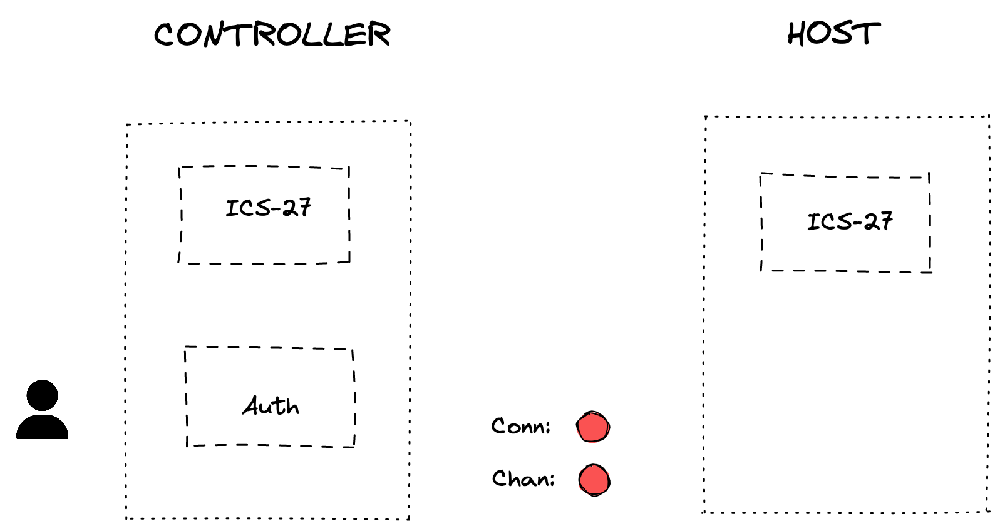
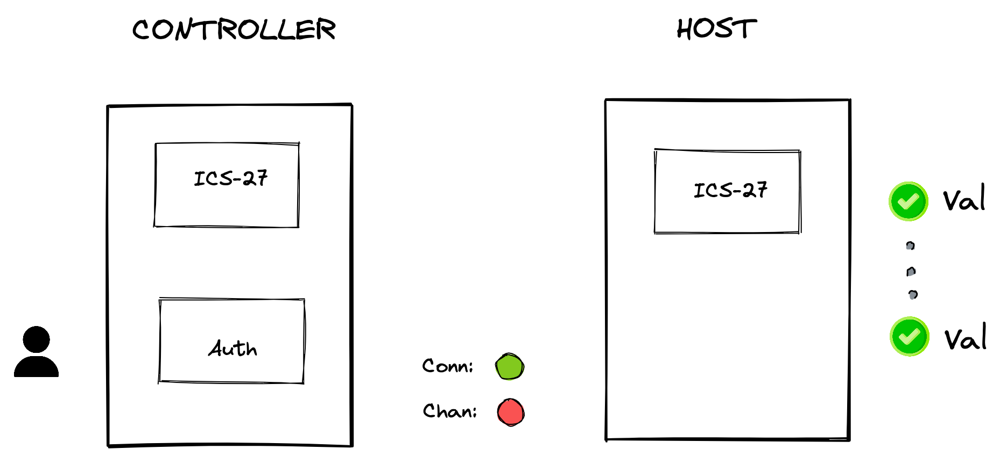
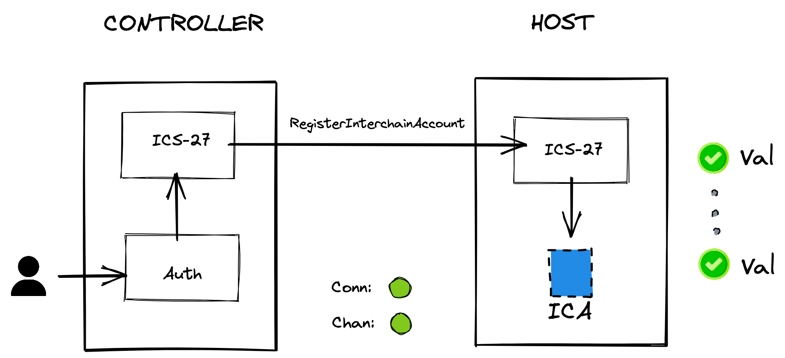
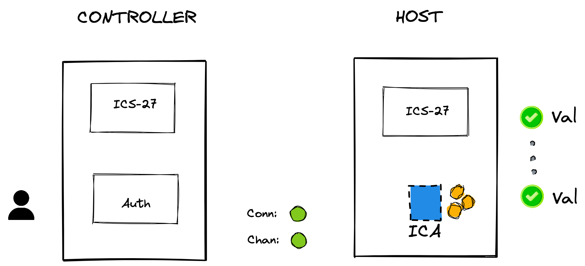
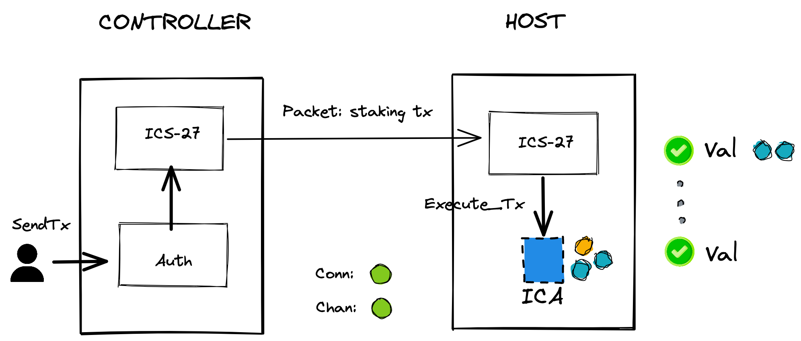

# Specy-Network

Describe specy

## Overview 

The

### Developer Documentation

specy developer docs can be found on the Specy-network documentation website.

https://specy-network.github.io/

## Setup

1. Clone this repository and build the application binary

```bash
git clone https://github.com/specy-network/specy.git -b specy-2
cd specy

make install 
```

2. Download and install an IBC relayer. ([hermes](https://hermes.informal.systems/), [go relayer](https://github.com/cosmos/relayer) or both ) 
```bash
# hermes (make sure to use v1.0.0 or later)
cargo install ibc-relayer-cli --bin hermes --locked

or

# go relayer (make sure to use v2.0.0-rc4 or later!)
git clone https://github.com/cosmos/relayer.git
cd relayer 
make install
```

3. Bootstrap two chains, configure the relayer and create an IBC connection (on top of clients that are created as well)
```bash
# hermes
make init-hermes

or

# go relayer
make init-golang-rly
```

:warning: **NOTE:** When you want to use both relayers interchangeably, using both of these `make` commands will set up two seperate connections (which is not needed and can lead to confusion). In the case of using both relayers, perform:
```bash
make init-golang-rly
./network/hermes/restore-keys.sh
```

4. Start the relayer
```bash
#hermes
make start-hermes

#go relayer
make start-golang-rly
```

:exclamation: **NOTE:** It is abstracted away in the script files, but in case you want to manually run `rly start` with interchain accounts, you will need to add this flag: `-p events` to it.

> This is the situation *before* `make init-*`. The blockchains are not live yet.


> This is the situation *after* `make init-*`. The chain binary's have been built and started, and an IBC connection between controller and host chains has been set up.


## Demo

**NOTE:** For the purposes of this demo the setup scripts have been provided with a set of hardcoded mnemonics that generate deterministic wallet addresses used below.

```bash
# Store the following account addresses within the current shell env
export WALLET_1=$(specyd keys show wallet1 -a --keyring-backend test --home ./data/test-1) && echo $WALLET_1;
export WALLET_2=$(specyd keys show wallet2 -a --keyring-backend test --home ./data/test-1) && echo $WALLET_2;
export WALLET_3=$(specyd keys show wallet3 -a --keyring-backend test --home ./data/test-2) && echo $WALLET_3;
export WALLET_4=$(specyd keys show wallet4 -a --keyring-backend test --home ./data/test-2) && echo $WALLET_4;
```

### Registering an Interchain Account via IBC

Register an Interchain Account using the `intertx register` cmd. 
Here the message signer is used as the account owner.

```bash
# Register an interchain account on behalf of WALLET_1 where chain test-2 is the interchain accounts host
specyd tx intertx register --from $WALLET_1 --connection-id connection-0 --chain-id test-1 --home ./data/test-1 --node tcp://localhost:16657 --keyring-backend test -y

# Query the address of the interchain account
specyd query intertx interchainaccounts connection-0 $WALLET_1 --home ./data/test-1 --node tcp://localhost:16657

# Store the interchain account address by parsing the query result: cosmos1hd0f4u7zgptymmrn55h3hy20jv2u0ctdpq23cpe8m9pas8kzd87smtf8al
export ICA_ADDR=$(specyd query intertx interchainaccounts connection-0 $WALLET_1 --home ./data/test-1 --node tcp://localhost:16657 -o json | jq -r '.interchain_account_address') && echo $ICA_ADDR
```

> This is the situation after registering the ICA. A channel has been created and an ICA has been registered on the host.


#### Funding the Interchain Account wallet

Allocate funds to the new Interchain Account wallet by using the `bank send` cmd.
Note this is executed on the host chain to provide the account with an initial balance to execute transactions.

```bash
# Query the interchain account balance on the host chain. It should be empty.
specyd q bank balances $ICA_ADDR --chain-id test-2 --node tcp://localhost:26657

# Send funds to the interchain account.
specyd tx bank send $WALLET_3 $ICA_ADDR 10000stake --chain-id test-2 --home ./data/test-2 --node tcp://localhost:26657 --keyring-backend test -y

# Query the balance once again and observe the changes
specyd q bank balances $ICA_ADDR --chain-id test-2 --node tcp://localhost:26657
```

> This is the situation after funding the ICA.


#### Sending Interchain Account transactions

Send Interchain Accounts transactions using the `intertx submit` cmd. 
This command accepts a generic `sdk.Msg` JSON payload or path to JSON file as an arg.

- **Example 1:** Staking Delegation

```bash
# Output the host chain validator operator address: cosmosvaloper1qnk2n4nlkpw9xfqntladh74w6ujtulwnmxnh3k
cat ./data/test-2/config/genesis.json | jq -r '.app_state.genutil.gen_txs[0].body.messages[0].validator_address'
```
 NOTE: According to $ICA_ADDR actual value modifycation *delegator_address* 
```bash
# Submit a staking delegation tx using the interchain account via ibc
specyd tx intertx submit \
'{
    "@type":"/cosmos.staking.v1beta1.MsgDelegate",
    "delegator_address":"cosmos15ccshhmp0gsx29qpqq6g4zmltnnvgmyu9ueuadh9y2nc5zj0szls5gtddz",
    "validator_address":"cosmosvaloper1qnk2n4nlkpw9xfqntladh74w6ujtulwnmxnh3k",
    "amount": {
        "denom": "stake",
        "amount": "1000"
    }
}' --connection-id connection-0 --from $WALLET_1 --chain-id test-1 --home ./data/test-1 --node tcp://localhost:16657 --keyring-backend test -y

# Alternatively provide a path to a JSON file
specyd tx intertx submit [path/to/msg.json] --connection-id connection-0 --from $WALLET_1 --chain-id test-1 --home ./data/test-1 --node tcp://localhost:16657 --keyring-backend test -y

# Wait until the relayer has relayed the packet

# Inspect the staking delegations on the host chain
specyd q staking delegations-to cosmosvaloper1qnk2n4nlkpw9xfqntladh74w6ujtulwnmxnh3k --home ./data/test-2 --node tcp://localhost:26657
```

> This is the situation before after sending the staking tx. The user who is the owner of the ICA has staked funds on the host chain to a validator of choice through an interchain accounts packet.


- **Example 2:** Bank Send

```bash
# Submit a bank send tx using the interchain account via ibc
specyd tx intertx submit \
'{
    "@type":"/cosmos.bank.v1beta1.MsgSend",
    "from_address":"cosmos15ccshhmp0gsx29qpqq6g4zmltnnvgmyu9ueuadh9y2nc5zj0szls5gtddz",
    "to_address":"cosmos10h9stc5v6ntgeygf5xf945njqq5h32r53uquvw",
    "amount": [
        {
            "denom": "stake",
            "amount": "1000"
        }
    ]
}' --connection-id connection-0 --from $WALLET_1 --chain-id test-1 --home ./data/test-1 --node tcp://localhost:16657 --keyring-backend test -y

# Alternatively provide a path to a JSON file
specyd tx intertx submit [path/to/msg.json] --connection-id connection-0 --from $WALLET_1 --chain-id test-1 --home ./data/test-1 --node tcp://localhost:16657 --keyring-backend test -y

# Wait until the relayer has relayed the packet

# Query the interchain account balance on the host chain
specyd q bank balances $ICA_ADDR --chain-id test-2 --node tcp://localhost:26657
```

#### Testing timeout scenario

1. Stop the relayer process and send an interchain accounts transaction using one of the examples provided above.

2. Wait for approx. 1 minute for the timeout to elapse.

3. Restart the relayer process

```bash
#hermes
make start-hermes

#go relayer
make start-golang-rly
```

4. Observe the packet timeout and relayer reacting appropriately (issuing a MsgTimeout to testchain `test-1`).

5. Due to the nature of ordered channels, the timeout will subsequently update the state of the channel to `STATE_CLOSED`.
Observe both channel ends by querying the IBC channels for each node.

```bash
# inspect channel ends on test chain 1
specyd q ibc channel channels --home ./data/test-1 --node tcp://localhost:16657

# inspect channel ends on test chain 2
specyd q ibc channel channels --home ./data/test-2 --node tcp://localhost:26657
```

6. Open a new channel for the existing interchain account on the same connection.

```bash
specyd tx intertx register --from $WALLET_1 --connection-id connection-0 --chain-id test-1 --home ./data/test-1 --node tcp://localhost:16657 --keyring-backend test -y
```

7. Inspect the IBC channels once again and observe a new creately interchain accounts channel with `STATE_OPEN`.

```bash
# inspect channel ends on test chain 1
specyd q ibc channel channels --home ./data/test-1 --node tcp://localhost:16657

# inspect channel ends on test chain 2
specyd q ibc channel channels --home ./data/test-2 --node tcp://localhost:26657
```


